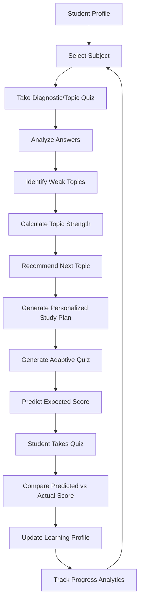

# AI Study Twin — Intelligent Personalized Learning Web Platform

AI Study Twin is a full-stack, machine learning-driven web application designed for college students. It builds a dynamic student learning profile, continuously tracks academic performance across subjects and topics, predicts expected quiz scores using machine learning regression, identifies weak and strong topics, generates tailored study schedules, and provides post-quiz AI explanations.

---

## 1. Core Learning Workflow



---

## 2. Key Features

- **Authentication & Student Profile**: JWT token authentication, password hashing (PBKDF2/SHA-256), college/major details, and custom learning goals.
- **Dynamic Learning Dashboard**: Top KPI cards (Overall Performance, Topics Mastered, Topics Needing Revision, ML Predicted Next Score), performance trend line chart, subject comparison bar chart, weak topic badges, top AI recommendation banner, and today's study schedule checklist.
- **Weak Topic Detection (Model 1)**: Rule-based & ML hybrid classifier categorizing performance into `Strong` (80–100%), `Average` (60–79%), `Weak` (40–59%), and `Very Weak` (<40%) with recency weighting.
- **Quiz Score Prediction (Model 2)**: `scikit-learn` Random Forest & Ridge Regressor model predicting percentage score (0–100%) before a student begins a quiz based on attempt count, topic accuracy, overall student average, revision frequency, time decay, and topic difficulty.
- **Hybrid Recommendation Engine (Model 3)**: Ranks topics according to weakness score, time since last studied (forgetting curve decay), topic importance weight, difficulty, and prerequisite fulfillment.
- **Tailored Revision System**: Calculates revision urgency (`High`, `Medium`, `Moderate`, `Light`) and recommended study minutes (e.g. 45m, 30m, 20m, 10m).
- **Adaptive Quiz Engine & AI Explanations**: MCQ layout with progress timer, question-by-question flow, instant post-quiz score comparison (Predicted vs Actual), detailed conceptual explanations for correct/incorrect choices, identified weak sub-concepts, and next topic recommendations.
- **Performance Analytics**: Interactive Chart.js charts including Doughnut distribution, Radar topic strengths map, Subject performance bar graph, and topic performance matrix.

---

## 3. Technology Stack

### Backend
- **Framework**: Python 3.14 + FastAPI
- **Web Server**: Uvicorn
- **Database ORM**: SQLAlchemy (Default SQLite for zero-setup execution, fully configurable for MySQL via `DATABASE_URL`)
- **Authentication**: PyJWT + Passlib / PBKDF2 Password Hashing
- **Data Validation**: Pydantic v2

### AI / Machine Learning
- **Libraries**: `scikit-learn`, `pandas`, `numpy`, `joblib`
- **Model 1**: Weak Topic Classifier (`RandomForestClassifier` + Recency Decay)
- **Model 2**: Quiz Score Predictor (`RandomForestRegressor` trained on student history)
- **Model 3**: Priority Ranking & Revision Recommendation Engine

### Frontend
- **Framework**: Single Page Application (SPA) built with React 18, Babel, and HTML5
- **Styling**: Tailwind CSS (Dark modern SaaS aesthetic with glassmorphism effects)
- **Charts**: Chart.js (Line, Bar, Radar, Doughnut)
- **Icons & Typography**: Lucide Icons, Google Fonts (Inter & Outfit)

---

## 4. API Endpoints Overview

| Method | Endpoint | Description |
| :--- | :--- | :--- |
| `POST` | `/api/auth/register` | Student registration & profile creation |
| `POST` | `/api/auth/login` | Student login & JWT token retrieval |
| `GET` | `/api/student/profile` | Fetch current student profile |
| `PUT` | `/api/student/profile` | Update profile information & learning goals |
| `GET` | `/api/dashboard` | Aggregated dashboard stats, charts, top recommendation, study plan |
| `GET` | `/api/subjects` | List subjects & topics with student accuracy badges |
| `GET` | `/api/subjects/{id}/topics` | Get topics for a specific subject |
| `POST` | `/api/quiz/start` | Start quiz attempt & receive ML predicted score |
| `POST` | `/api/quiz/submit` | Submit answers, compare predicted vs actual score, update learning profile |
| `GET` | `/api/quiz/history` | Quiz attempt history & score differences |
| `GET` | `/api/performance` | Detailed analytics data for Doughnut, Radar, and Line charts |
| `GET` | `/api/recommendations` | Priority-ranked recommendations with AI reasons |
| `GET` | `/api/study-plan` | Dynamic daily study plan schedule |
| `GET` | `/api/prediction` | ML score prediction log & model information |

---

## 5. Local Setup & Running Instructions

### Prerequisites
- Python 3.10+ installed
- Web browser (Chrome, Edge, Firefox)

### Step 1: Install Python Dependencies
Navigating to the project root:
```bash
cd backend
python -m pip install -r requirements.txt
```

### Step 2: Train ML Models & Seed Database
Train the `joblib` model artifacts and seed default CS subjects (Java OOP, Data Structures, DBMS, etc.):
```bash
python -m app.ml.trainer
python -m app.database.seed
```

### Step 3: Run FastAPI Server
Start the Uvicorn dev server:
```bash
python -m uvicorn app.main:app --host 127.0.0.1 --port 8000 --reload
```

### Step 4: Access Application
Open your browser and navigate to:
- **Application Dashboard**: [http://127.0.0.1:8000/](http://127.0.0.1:8000/)
- **API Documentation**: [http://127.0.0.1:8000/docs](http://127.0.0.1:8000/docs)

**Default Demo Credentials:**
- **Email**: `student@demo.edu`
- **Password**: `password123`
